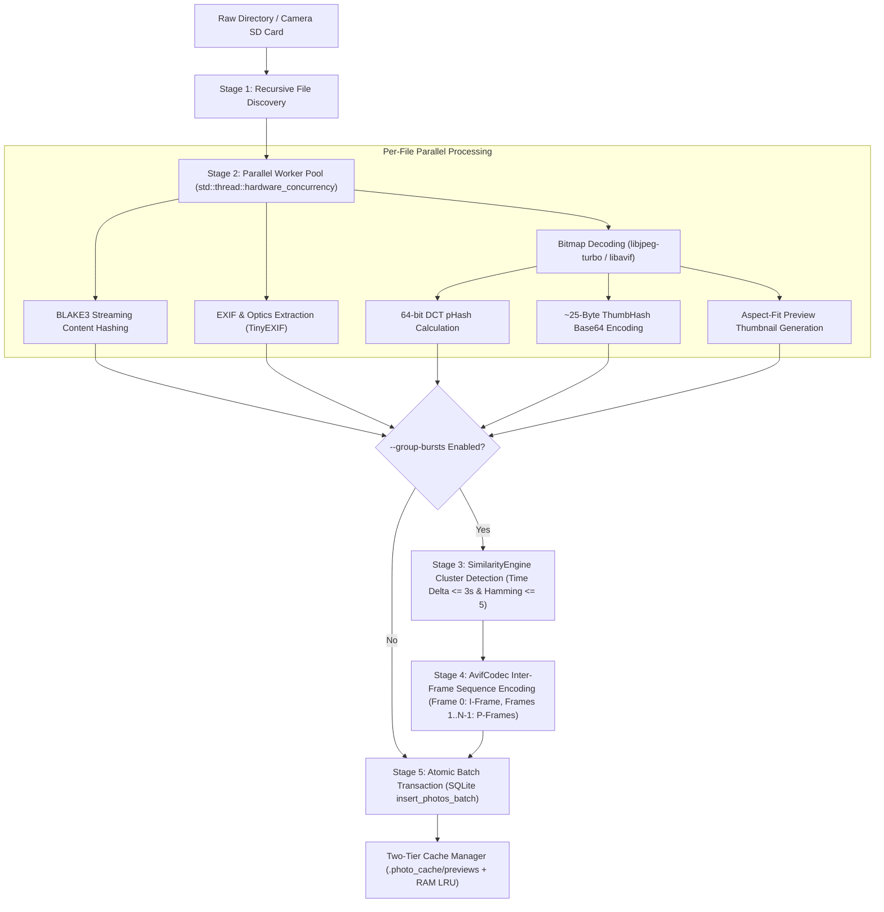
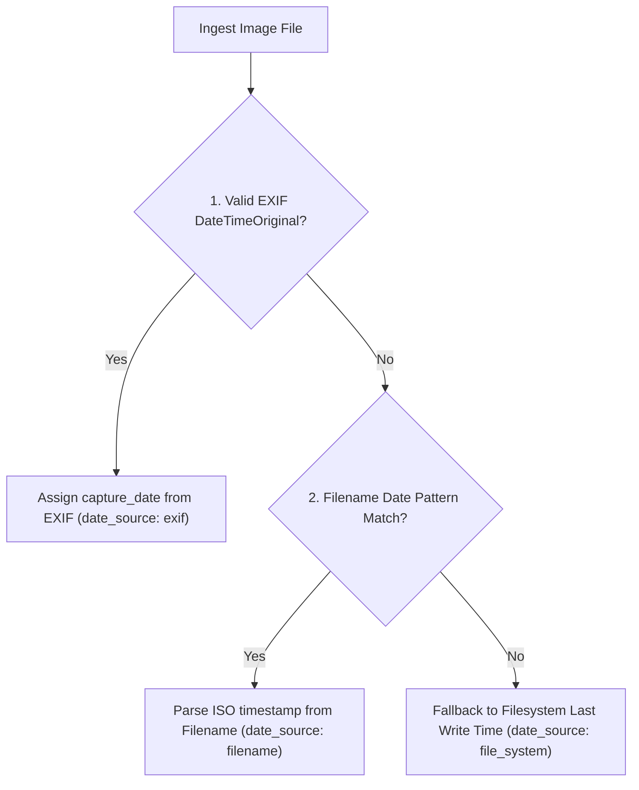
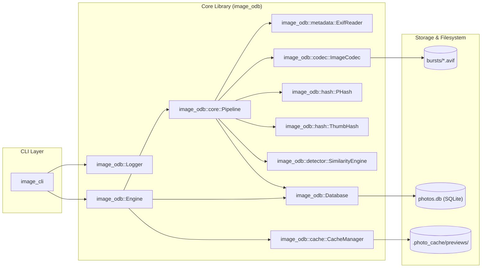

# `image-ODB` — High-Performance C++20 Photo Database & AVIF Multi-Frame Engine

[](https://en.wikipedia.org/wiki/C%2B%2B20)
[](https://cmake.org/)
[](LICENSE)

**`image-ODB`** is a modern, high-throughput C++20 photo library (`image_odb`) and CLI utility (`image_cli`) designed for large-scale photo indexing, visual similarity search, optical EXIF analysis, and extreme storage reduction using **AVIF multi-frame inter-frame sequence compression**.

---

## 📑 Table of Contents

1. [High-Level Overview](#-high-level-overview)
2. [How `image-ODB` Works (Deep Dive)](#-how-image-odb-works-deep-dive)
   - [1. Ingestion Pipeline & Multithreading](#1-ingestion-pipeline--multithreading)
   - [2. Fast Cryptographic Deduplication (BLAKE3)](#2-fast-cryptographic-deduplication-blake3)
   - [3. 64-bit DCT Perceptual Hashing (pHash)](#3-64-bit-dct-perceptual-hashing-phash)
   - [4. Visual Placeholder Engine (ThumbHash)](#4-visual-placeholder-engine-thumbhash)
   - [5. AVIF Multi-Frame Sequence Compression](#5-avif-multi-frame-sequence-compression)
   - [6. Exception-Safe Codec Architecture & Format Conversion](#6-exception-safe-codec-architecture--format-conversion)
   - [7. Smart Capture Date Fallback Chain](#7-smart-capture-date-fallback-chain)
   - [8. Relational Metadata Storage (SQLiteCpp)](#8-relational-metadata-storage-sqlitecpp)
   - [9. Configurable Multi-Tier Cache Hierarchy (RAM LRU + Disk)](#9-configurable-multi-tier-cache-hierarchy-ram-lru--disk)
   - [10. Unified Colored Logging Subsystem (spdlog)](#10-unified-colored-logging-subsystem-spdlog)
3. [Architecture & Data Flow](#-architecture--data-flow)
4. [C++ API Embedding Guide](#-c-api-embedding-guide)
5. [CLI Tool Quick Start (`image_cli`)](#-cli-tool-quick-start-image_cli)
6. [Build & Installation](#-build--installation)
7. [Automated Test Suite](#-automated-test-suite)
8. [License](#-license)

---

## 🌟 High-Level Overview

Managing tens of thousands of high-resolution digital camera photos presents major challenges:
1. **Burst Shot Storage Bloat:** Continuous shooting modes generate 5–30 nearly identical RAW/JPEG images per action sequence, wasting gigabytes of disk space.
2. **Metadata Fragmentation & Missing EXIF:** Camera models, lens optics, exposure parameters, and GPS tags are buried in diverse EXIF formats, while many photos lack EXIF timestamps entirely.
3. **Format Inefficiencies:** Archiving mixed JPEG/PNG collections without a seamless way to modernize them to AVIF containers with embedded thumbnails.
4. **Cache & Resource Control:** Inflexible thumbnail preview generation that can exhaust disk space or RAM in CLI-heavy pipelines.

**`image-ODB` solves these problems by:**
* Compressing burst sequences into a single standard **AVIF multi-frame container** using **I-Frame + P-Frame temporal prediction** (saving **80–90% disk space** while retaining the ability to extract any individual frame with zero quality loss).
* Converting standalone image collections (`.jpg`, `.jpeg`, `.png`, `.webp`, `.tiff`, `.bmp`) to/from modern **AVIF** containers on-the-fly with optional **embedded thumbnails** (`--embed-thumb`).
* Computing scale-invariant **64-bit DCT `pHash`** and ultra-compact $\sim 25$-byte **`ThumbHash`** visual placeholders.
* Ingesting dates reliably via a **3-tier date fallback chain** (EXIF $\to$ Filename regex pattern $\to$ Filesystem modification timestamp).
* Deduplicating files at memory-speed using hardware-accelerated **BLAKE3 cryptographic hashing**.
* Storing **27 optical and exposure attributes** in an indexed, relational **SQLite database** with foreign key cascades.
* Providing a **Configurable Cache Hierarchy** (`CacheMode::ALL`, `DISK_ONLY`, `RAM_ONLY`, `NONE`) to tailor memory and disk consumption to any environment.
* Providing a **Centralized Logger** with colored console sinks and runtime `--loglevel` control for full pipeline observability.

---

## 🔬 How `image-ODB` Works (Deep Dive)



---

### 1. Ingestion Pipeline & Multithreading

The ingestion engine ([`src/core/pipeline.cpp`](src/core/pipeline.cpp)) executes a multi-stage workflow:

1. **Discovery & File Filtering:** Recursively traverses directories, detecting supported formats (`.jpg`, `.jpeg`, `.avif`, `.png`, `.webp`).
2. **Fast Deduplication:** Computes BLAKE3 content hashes. If a file is already indexed by hash or path, it is skipped immediately to avoid redundant processing.
3. **Thread Pool Parallelism:** Chunks files across worker threads scaling to all logical CPU cores (`std::thread::hardware_concurrency()`). Each thread decodes bitmaps, extracts EXIF, computes pHash / ThumbHash, and pre-generates thumbnails concurrently.
4. **Burst Sequence Detection:** When burst grouping is enabled, candidates are chronologically sorted and clustered based on time proximity ($\Delta t \le 3\text{s}$) and visual similarity ($\text{Hamming} \le 5$).
5. **Atomic Batch Ingestion:** Inserts photo records into the database inside a single atomic SQLite transaction (`insert_photos_batch`), reaching throughputs of **200+ photos/second**.

---

### 2. Fast Cryptographic Deduplication (`BLAKE3`)

`image-ODB` uses the modern **BLAKE3** cryptographic hashing algorithm ([`src/core/pipeline.cpp`](src/core/pipeline.cpp)):
* **High Throughput:** Tree-based hashing structure leveraging CPU SIMD instructions (AVX-512 / AVX2 / SSE4.1 / NEON), outperforming SHA-256 by up to $10\times$.
* **Streaming Chunking:** Files are processed in 64 KB buffer streams with constant memory overhead.
* **Exact Duplicate Prevention:** Guarantees absolute collision resistance for photo identity across different folders or file names.

---

### 3. 64-bit DCT Perceptual Hashing (`pHash`)

Perceptual hashing maps visually identical or similar images to identical or near-identical 64-bit integers ([`src/phash.cpp`](src/phash.cpp)):

$$\text{Hamming Distance} = \text{popcount}(h_1 \oplus h_2)$$


1. **Area-Averaging Box Downsampling:** Downscales arbitrary dimensions ($W \times H$) to a standard $32 \times 32$ luminance grid via box integration, avoiding discrete sampling noise.
2. **2D Discrete Cosine Transform (DCT-II):** Computes frequency components across the $32 \times 32$ matrix:
   $$D(u,v) = \alpha(u)\alpha(v) \sum_{x=0}^{31} \sum_{y=0}^{31} f(x,y) \cos\left[\frac{(2x+1)u\pi}{64}\right] \cos\left[\frac{(2y+1)v\pi}{64}\right]$$
3. **AC Mean Thresholding:** Extracts top-left $8 \times 8$ low-frequency coefficients (omitting DC $(0,0)$ to maintain illumination invariance). Sets bit $i = 1$ if coefficient $> \text{mean}$.
4. **Hardware Bitwise Distance:** Computes Hamming distance in a single CPU cycle using `std::popcount(h1 ^ h2)`.

---

### 4. Visual Placeholder Engine (`ThumbHash`)

`ThumbHash` generates ultra-compact $(\sim 25\text{ byte})$ visual placeholders encoded as Base64 strings ([`src/thumbhash.cpp`](src/thumbhash.cpp)):

1. **Color Space Decomposition:** Converts sRGB to perceptual Luminance ($L$) and Chrominance ($P, Q$), plus Alpha ($A$):
   $$L = \frac{R+G+B}{3}, \quad P = \frac{R-B}{2}, \quad Q = \frac{2G-R-B}{4}$$
2. **Dynamic Frequency Grid:** Automatically allocates frequency channels ($l_x \times l_y \le 7 \times 7$) based on aspect ratio.
3. **Compact Quantization:** Quantizes DC components and AC coefficients into 4-bit values packed into a compact binary header.
4. **Inverse 2D DCT Synthesis:** Decodes Base64 strings back into an RGBA $32 \times 32$ bitmap without reading source files from disk, enabling instantaneous 60 FPS blurred UI placeholders in web and native user interfaces.

---

### 5. AVIF Multi-Frame Sequence Compression

When burst shooting (e.g. sports or wildlife), adjacent frames differ only slightly. `image-ODB` exploits these temporal similarities using AV1 inter-frame prediction ([`src/avif_codec.cpp`](src/avif_codec.cpp), [`src/similarity_engine.cpp`](src/similarity_engine.cpp)):

* **Clustering Criteria:**
  $$\Delta t \le 3\text{ seconds} \quad \text{and} \quad \text{Hamming Distance}(h_1, h_2) \le 5$$
* **Sequence Architecture:**
  * **Frame 0 (Keyframe / I-Frame):** Encoded with `AVIF_ADD_IMAGE_FLAG_FORCE_KEYFRAME`. Represents the anchor shot in full intra-coded quality.
  * **Frames $1 \dots N-1$ (Predicted / P-Frames):** Encoded with `AVIF_ADD_IMAGE_FLAG_NONE`. Stores only motion vectors and residual pixel changes.
* **Storage Reduction:** Compresses 5–20 high-resolution photos into a single `.avif` container, reducing disk usage by **$80\text{--}90\%$**.
* **Arbitrary Frame Extraction:** Any frame can be extracted directly via `AvifCodec::extract_frame(path, index)` without decoding the entire sequence.

---

### 6. Exception-Safe Codec Architecture & Format Conversion

* **`libjpeg-turbo` Engine ([`src/jpeg_codec.cpp`](src/jpeg_codec.cpp)):**
  * Traditional `libjpeg` terminates the entire host process on corrupted input via `exit(1)`.
  * `image-ODB` uses a custom `CustomJpegErrorMgr` with `setjmp`/`longjmp` exception traps, safely catching corruption errors and returning empty buffers without crashing.
  * Windows Unicode path compatibility is guaranteed using `_wfopen`.
* **`libavif` Engine & Embedded Thumbnails ([`src/avif_codec.cpp`](src/avif_codec.cpp)):**
  * Configured with `aom` (encoding) and `dav1d` (SIMD-accelerated AV1 decoding).
  * Encodes standard ISOBMFF containers with BT.709 color primaries and sRGB transfer characteristics.
  * **Embedded Thumbnails (`--embed-thumb`):** When enabled, downscales image to aspect-fit dimensions ($\le 256\text{px}$) and attaches the preview metadata directly inside the AVIF container.
* **Unified Image Codec & Extensibility ([`src/image_codec.cpp`](src/image_codec.cpp)):**
  * Automatic format sniffing from magic header bytes or file extensions (`.jpg`, `.jpeg`, `.avif`, `.png`, `.webp`, `.tif`, `.bmp`).
  * Seamless bidirectional transcoding via CLI commands (`image` and `convert`).

---

### 7. Smart Capture Date Fallback Chain

Photographs often lack EXIF metadata (e.g. messaging app downloads, social media exports, or legacy scans). `image-ODB` ensures chronological order using a 3-tier fallback engine ([`src/exif_reader.cpp`](src/exif_reader.cpp)):



1. **Tier 1 (EXIF):** Extracts standard `EXIF:DateTimeOriginal` or `DateTimeDigitized`.
2. **Tier 2 (Filename Regex):** Parses patterns like `IMG_20240815_134520.jpg`, `2023-11-20_09-15-30.jpg`, `Screenshot_20240501-182045.png`, or `20240101.jpg`.
3. **Tier 3 (Filesystem Timestamp):** Converts `std::filesystem::last_write_time` to UTC `capture_date` fallback.

---

### 8. Relational Metadata Storage (`SQLiteCpp`)

The database layer ([`src/database.cpp`](src/database.cpp)) uses SQLite with `PRAGMA foreign_keys = ON`:

* **`photos` Table (27 Attributes):**
  * **File:** `id`, `file_path`, `file_size`, `hash` (BLAKE3), `mime_type`, `created_at`
  * **Dimensions:** `width`, `height`, `orientation`
  * **Time & Place:** `capture_date` (ISO8601), `latitude`, `longitude`, `altitude`, `location`
  * **Camera & Optics:** `camera_make`, `camera_model`, `lens_model`, `focal_length_mm`, `focal_length_in_35mm`
  * **Exposure:** `f_number`, `exposure_time`, `iso_speed`, `exposure_bias`, `flash_fired`
  * **Hashes & Bursts:** `phash`, `thumbhash`, `is_burst_group`, `frame_count`, `exif_json`
* **`burst_frames` Table:** Stores sub-frame geometry, pHash, and JSON metadata linked via `FOREIGN KEY(photo_id) REFERENCES photos(id) ON DELETE CASCADE`.
* **Multi-Column Indices:** Composite indices on `capture_date`, `(camera_make, camera_model)`, `lens_model`, `location`, `phash`, and `(latitude, longitude)`.

---

### 9. Configurable Multi-Tier Cache Hierarchy (RAM LRU + Disk)

Preview resolution flows through three tiers ([`src/cache_manager.cpp`](src/cache_manager.cpp), [`src/lru_cache.cpp`](src/lru_cache.cpp), [`src/disk_cache.cpp`](src/disk_cache.cpp)):

```text
Request Preview(photo_id)
       │
       ├──► 1. Tier-1: In-Memory LRU RAM Cache (Fastest, Mutex Protected)
       │         └─ HIT: Return ImageBuffer (< 0.1 ms)
       │
       ├──► 2. Tier-2: Disk Preview Cache (.photo_cache/previews/)
       │         └─ HIT: Decode .avif/.jpg thumbnail, store in RAM, return (~ 2 ms)
       │
       └──► 3. Tier-3: Source File Synthesis
                 └─ MISS: Decode full image, resize aspect-fit (500px),
                          save to disk cache, populate RAM, return (~ 25 ms)
```

#### Cache Modes (`--cache`):
* `all` (Default): Both RAM LRU and `.photo_cache/` disk storage active for maximal responsiveness.
* `disk`: Disables RAM LRU memory caching, saving memory for low-RAM CLI and daemon workflows.
* `ram`: Operates entirely in volatile RAM without generating any `.photo_cache/` files on disk.
* `none`: Completely disables preview caching for minimum I/O overhead.

---

### 10. Unified Colored Logging Subsystem (`spdlog`)

`image-ODB` provides a centralized logging architecture ([`include/image_odb/logger.h`](include/image_odb/logger.h), [`src/logger.cpp`](src/logger.cpp)):

* **Colored Console Output:** Uses `spdlog::sinks::stdout_color_sink_mt` with timestamp pattern `[%Y-%m-%d %H:%M:%S.%e] [%^%l%$] %v`.
* **Runtime Configurable:** Configurable programmatically via `image_odb::Logger::configure_with(...)` or via CLI `--loglevel=["trace"|"debug"|"info"|"warn"|"error"|"critical"|"off"]` and `-v, --verbose`.
* **Subsystem Tracing:** High-granularity `spdlog::debug` statements across Engine, Pipeline, Codecs, SQLite database operations, similarity clustering, and cache transactions.

---

## 🏛️ Architecture & Data Flow



---

## 💻 C++ API Embedding Guide

Embed `image_odb` directly into your C++20 applications:

### 1. CMake Integration
```cmake
find_package(image_odb REQUIRED) # or add_subdirectory(image-ODB)
target_link_libraries(my_app PRIVATE image_odb::image_odb)
```

### 2. Ingesting & Querying in C++
```cpp
#include <image_odb/image_odb.h>
#include <iostream>

int main() {
    using namespace image_odb;

    // 1. Configure logging (optional, defaults to INFO colored console)
    Logger::configure_with("debug");

    // 2. Initialize engine with a workspace directory
    Engine engine("C:/MyPhotoWorkspace");
    engine.initialize_workspace();

    // 3. Configure and run scanning pipeline
    ScanOptions scan_opts;
    scan_opts.group_bursts = true;
    scan_opts.recursive = true;
    scan_opts.generate_previews = true;

    uint64_t count = engine.scan_directory("D:/DCIM/Camera", scan_opts, 
        [](uint64_t done, uint64_t total, const std::string& file) {
            std::cout << "Indexing [" << done << "/" << total << "] " << file << "\n";
        }
    );

    // 4. Query photos with rich filters
    ListOptions filter;
    filter.camera_make_filter = "Sony";
    filter.min_iso = 100;
    filter.max_iso = 800;
    filter.sort_by = "capture_date";
    filter.ascending = false;
    filter.limit = 25;

    std::vector<Photo> results = engine.list_photos(filter);
    for (const auto& photo : results) {
        std::cout << "Photo #" << photo.id << ": " 
                  << photo.camera.make << " " << photo.camera.model 
                  << " | " << photo.file_path.string() << "\n";

        // Fetch AVIF thumbnail preview from two-tier cache
        auto preview = engine.get_preview(photo.id);
        if (preview.has_value()) {
            std::cout << "  Preview bitmap: " << preview->width << "x" << preview->height << "\n";
        }
    }

    return 0;
}
```

---

## 🖥️ CLI Tool Quick Start (`image_cli`)

For complete command details, refer to the **[CLI Documentation Guide](cli/README.md)**.

```bash
# 1. Initialize a workspace (Or simply run list/preview to trigger first-time interactive prompt)
image_cli init -d C:\PhotosDB

# 2. Standalone transcoding (Encode JPEG/PNG to AVIF with embedded thumbnail)
image_cli image photo.jpg -o photo.avif --encode -q 85 -s 6 --embed-thumb

# 3. Decode AVIF to JPEG
image_cli image photo.avif -o photo.jpg --decode -q 90

# 4. Scan directory with automatic burst clustering, on-the-fly AVIF conversion, and disk-only cache
image_cli scan D:\DCIM -d C:\PhotosDB --group-bursts --convert --delete-source --cache disk

# 5. Batch convert all non-AVIF indexed photos in the database
image_cli convert -d C:\PhotosDB --all -f avif -q 80 --embed-thumb

# 6. Filter photos (Tabular view)
image_cli list -d C:\PhotosDB --camera-make Sony --lens "24-70mm" --limit 10

# 7. Export query results as JSON
image_cli list -d C:\PhotosDB --burst-only --json > bursts.json

# 8. Extract a specific frame from a multi-frame AVIF container
image_cli extract C:\PhotosDB\bursts\burst_1a2b.avif -f 1 -o best_frame.jpg

# 9. Inspect or clear cache
image_cli cache -d C:\PhotosDB --clear
```

---

## 🔨 Build & Installation

### Prerequisites
* **C++20 Compiler:** MSVC 19.30+ (Visual Studio 2022/2026), Clang 15+, or GCC 12+
* **CMake:** >= 3.24
* **vcpkg:** Installed with `VCPKG_ROOT` environment variable configured

### Build with CMake Presets:

```bash
# Clone the repository
git clone https://https://github.com/ByaCherX/image-ODB
cd image-ODB

# Build using windows-clang preset (or windows-msvc / linux-gcc)
cmake --build --preset windows-clang

# Run the test suite
ctest --test-dir build-clang --output-on-failure
```

### Standard CMake Build:

```bash
cmake -S . -B build -DCMAKE_TOOLCHAIN_FILE="%VCPKG_ROOT%/scripts/buildsystems/vcpkg.cmake" -DCMAKE_BUILD_TYPE=Release
cmake --build build --config Release
ctest --test-dir build -C Release --output-on-failure
```

---

## 📜 License

This project is licensed under the MIT License. See [LICENSE](LICENSE) for details.

